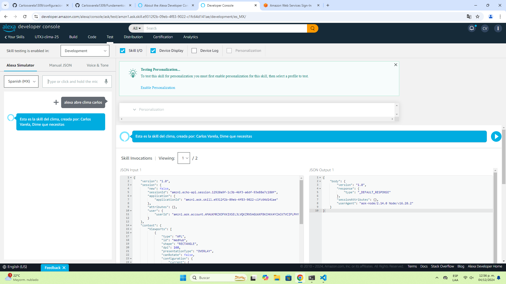

# configuracion-Alexa
Proyecto de clase configuración de la Alexa para la Unidad 3 de la Asignatura de Desarrollo Móvil Integral (DMI) 

# Documentación
|No.|Nombre |Potenciador |Estatus |
|-- |-- |-- |-- |
|1 |Metodologia de Evaluación de la Asignatura |1 |Finalizada |

